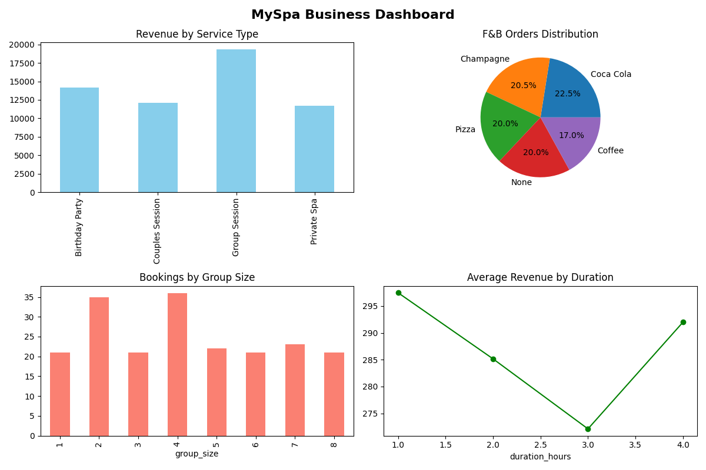

 MySpa Business Analytics Dashboard

Project Overview
This project analyzes mock booking and revenue data for MySpa — a private spa franchise in Germany.
The goal is to extract business insights and help management make data-driven decisions.

 Key Insights
- Total Revenue: €57,242 across 200 bookings
- Most Popular Service: Group Session
- Most Popular F&B Item: Coca Cola
- Average Revenue per Booking: €286.21

Tools & Libraries
- Python
- Pandas
- Matplotlib
- Seaborn
- Faker

Dashboard Preview

Files
- `myspa.ipynb` — Full analysis notebook
- `myspa_data.csv` — Mock dataset (200 bookings)
- `myspa_dashboard.png` — Business dashboard
